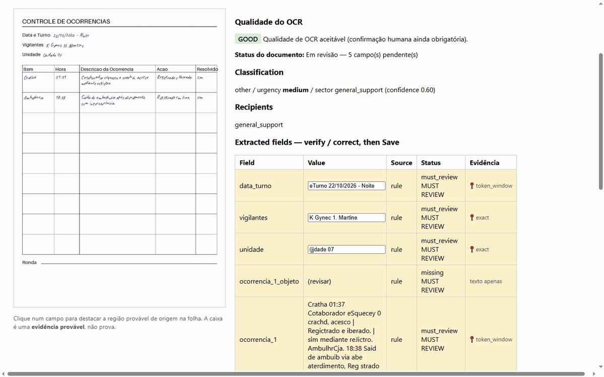
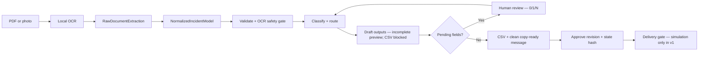

# Security Shift Intake — Local Document AI for Security Incident Logs

[](https://github.com/JoaoMiltzarek/security-shift-intake/actions/workflows/ci.yml)


Local, privacy-first triage for handwritten **security incident sheets** ("Controle de
ocorrências"). The default path turns a photo or scan into a reviewable draft, a standardized
spreadsheet and a copy-ready message without sending the document to a cloud service.

> **Tesseract is not reliable on cursive handwriting. Human review is mandatory for clean output;
> approval is mandatory before the built-in delivery simulation.**

## In 30 seconds



```console
uv sync --locked --python 3.11.15
make demo
```

Python 3.11.15 is the exact supported interpreter for the v1 environment; `uv.lock` and CI
enforce that patch level. The showcase additionally requires the Tesseract executable and its
Portuguese (`por`) language pack.

`make demo` runs the committed synthetic sheet through real local Tesseract, starts the review
UI on `127.0.0.1`, opens the draft, and sends nothing. Stop with `Ctrl+C`, then run
`make purge-demo-data`.

What is already enforced, not merely planned:

- a blocking **browser-smoke** job drives the cockpit under its real CSP in Chromium;
- **eval-safety** gates structural failures continuously, while the held-out benchmark publishes
  its failed gate instead of retuning on the test split;
- hundreds of offline unit, integration, security and privacy tests run at **$0**; the showcase
  fixture also exercises real Tesseract in CI;
- an anti-corruption boundary separates layout-coupled `RawDocumentExtraction` from the stable
  domain `NormalizedIncidentModel`.



## The problem
Every shift, a guard fills a paper occurrence sheet by hand; someone retypes it into a
spreadsheet and a message. It's manual, repetitive, and error-prone. And it's hard to automate
honestly: the sheets are **handwritten** (free OCR fails on cursive), the data is **sensitive
PII** (must not go to an external API), and automation **must not invent** information.

## The solution
A staged, **config-driven** pipeline within the supported schema families, whose default path
runs fully locally (no paid API, no cloud):
local OCR → best-effort extraction → an **OCR quality gate** → auditable per-field results →
normalization → **human review** → blocked drafts when unsafe → an append-only audit trail
with per-revision content snapshots. Approval records the revision and hashes the stored state
at approval time; it does not claim optimistic-concurrency proof of what a separate browser tab
displayed.
It doesn't replace the human; it **reduces transcription load and surfaces uncertainty**.
External Anthropic and remote-VLM utilities exist only as explicit opt-in experiments; they are
not used by `make demo` or by the default pipeline.

### Two outputs
**Output 1 — standardized spreadsheet**

| DIA | UNIDADE | OBJETO | DESCRIÇÃO |
|---|---|---|---|
| 25/06/2026 | 1 | Alarme | HH:MM - Alarme disparou 4 vezes |
| 25/06/2026 | 2 | Sem alteração | |

**Output 2 — copy-ready message** (paste into WhatsApp/e-mail; never auto-sent):

```
Bom dia,

DIA | UNIDADE | OBJETO | DESCRIÇÃO
25/06/2026 | 1 | Alarme | HH:MM - Alarme disparou 4 vezes
25/06/2026 | 2 | Sem alteração |

Vigilantes: ...
```

If any required field is pending, the message is marked **`RASCUNHO INCOMPLETO`** and lists
exactly what to fix — it never goes out as a clean operational message.

## Evidence cockpit (auditable review)
The review screen is an **evidence cockpit**: the OCR page image sits beside the extracted
fields, and clicking a field highlights the **probable region** the value came from. Every
value answers *where it came from, with what confidence, by which method, and whether a human
reviewed it*:

Confidence values are source-specific routing signals, not calibrated probabilities:
rule-based values use conservative fixed placeholders, Tesseract supplies mean word confidence,
and VLM fallback values are labeled placeholders. Review status remains the operational gate.

The animation above is captured from the committed synthetic sheet through the real Tesseract
path; its hashes, tool versions and regeneration procedure are in
[samples/README.md](samples/README.md).

- **`exact`** — the value matched a contiguous run of OCR words (box = union of those words).
- **`token_window`** — the value's tokens matched within one OCR line (partial score).
- **`none`** — no match; the field shows a textual fallback, never a blank or a wrong box.
- **`human_edit`** — a human edited the value, so the old OCR box is **discarded**.

The box is **probable evidence, not ground truth** — a hint that points the reviewer at the
most likely source region. Boxes are normalized (0..1) against the *same* downscaled image
Tesseract read, so the overlay lines up; the image is served **path-safe** from the gitignored
`private/` tree. When the reader emits no geometry (mock/VLM path), the cockpit degrades to the
plain review layout. Reviewed sheets export to **CSV** — but the button is **blocked while any
field is pending**, and the CSV always carries the post-review values, never the raw OCR.

## Quick demo
```console
# One command: synthetic fixture -> real Tesseract -> loopback review UI.
make demo

# After Ctrl+C:
make purge-demo-data

# Local quality and privacy gates:
make check
make privacy-check
```

The v1 input contract accepts **exactly one page or image frame** per document. Supported
formats are PDF, PNG, JPEG, TIFF, BMP and WebP. A multi-page PDF or multi-frame image is
**rejected before OCR**; split it into single-page files. This is a product-scope boundary, not
an OCR result.

Process a **real** sheet locally (the Tesseract executable is required; the Portuguese language
pack is recommended, with an `eng` fallback; the file stays in the gitignored `private/`
folder, never committed):
```console
# Uses the v1 occurrence-table config (configs/controle_ocorrencias.yaml).
make demo-pipeline FILE="private/reais/your-file.pdf"  # replace with your private file
make serve SERVE_ARGS="--port 8000"
make purge-demo-data           # remove active demo artifacts when done
```

`make demo-pipeline-mock` remains available as a no-Tesseract UI fallback. It deliberately has
no OCR geometry and therefore cannot demonstrate click-to-highlight. The local VLM path is an
experimental reader that is loopback by default (remote use requires an explicit unsafe opt-in):
it emits no geometry and the current frozen benchmark does **not** admit it as the default.

### Experimental / outside v1

- `AnthropicLLMClient` is mock-tested but not wired into the v1 pipeline. Anthropic Vision is a
  separate, paid external opt-in and is never selected by the default showcase.
- PP-OCRv5 was measured and **not promoted**. The adapter remains an experimental opt-in via
  `INTAKE_VISION=paddle_ocr`, is not installed by uv sync, and requires an isolated environment
  with the Paddle stack; it is not part of `make demo` or the release gate.

### Evaluate a reader (the decision protocol)
Reader adoption follows the frozen synthetic `tier_c` gates (G-S0…G-S3 + G1-S), not private
real sheets. BRESSAY is a secondary, non-blocking diagnostic and never changes a reader or
release verdict by itself. The normative protocol is
[docs/DATASET_CONTRACT.md](docs/DATASET_CONTRACT.md); hardware, release-safety and candidate
promotion criteria are frozen in [docs/READER_DECISION.md](docs/READER_DECISION.md) before a
new val run.

The real-sheet eval below is an optional local diagnostic for fully authorized files. It does not
select the default reader, and neither its private detail nor source sheets may be committed:

```console
# Optional diagnostic: curations must be verified_by_user (docs/CURADORIA_FORMATO.md).
make eval-real VISION=local_ocr DPI=150      # instrumented baseline
make eval-real VISION=local_vlm DPI=150      # explicit opt-in; requires Ollama
make eval-real VISION=local_vlm DPI=250      # DPI sensitivity; lower to 100 after VRAM OOM
uv run --locked python -m evals.eval_extraction_real --compare private/audit/eval_real_detailed_local_ocr_dpi150.json private/audit/eval_real_detailed_local_vlm_dpi150.json
```
Detailed output (PII) and the allowlisted local summary stay in gitignored `private/audit/`.
The evaluator never overwrites `docs/eval_real_summary.json`; that file is a
**historical, directional, pre-runtime-attestation diagnostic** and is not release evidence. If a separate
authorized publication is needed, allowlisted, value-free public evidence may contain run
aggregates, pseudonymous per-sheet counters and paired outcome labels, but never source values,
transcriptions or paths. A secondary reader sanity check is available:

```console
uv run --locked python -m scripts.build_bressay_manifest --bressay-dir datasets/bressay --n 20
make eval-bressay N=20
```

## Setup & troubleshooting
The release CI target is Ubuntu. Windows native is also exercised: `make check`, the real
Tesseract showcase, browser interaction and purge have been run end to end. The blocking
browser-smoke remains canonical in CI so every change is checked in the same clean environment.
Probe your machine before running:
```console
python scripts/preflight.py --json   # stdlib only; needs no uv/venv
```
It reports uv/make/tesseract/chromium, symlink support, stray SQLite DBs, and the pre-commit
hook, with a severity (0 clean / 1 warn / 2 blocker) — it only detects, never mutates.

- **No `make`?** The showcase equivalents are
  `uv run --locked python -m scripts.showcase_demo`,
  `uv run --locked python -m scripts.serve`, and
  `uv run --locked python -m scripts.purge_demo_data demo`. Quality equivalents are
  `uv run --locked pytest`, `uv run --locked ruff check .`, and
  `uv run --locked mypy src data scripts evals`.
- **No Tesseract?** The real OCR path exits with a clear installation error before creating a
  draft. Use `make demo-pipeline-mock` only as an explicit UI fallback; it has no OCR geometry.

## Architecture
The Mermaid flow above shows the executable default path. Draft outputs are built before review
so the operator can inspect them. **CSV export requires no pending fields** and uses the reviewed
state; the copy-ready preview is visibly incomplete while fields are pending. Only the delivery
simulation requires the approved revision and matching stored-state hash.

Two decoupled models keep the domain stable as the sheet layout changes:
- **`RawDocumentExtraction`** — what was read (header + table cells), each an **`AuditedField`**
  (value + confidence + source `ocr|rule|human` + status + evidence).
- **`NormalizedIncidentModel`** — what the domain understands, with disposition
  `unknown | none | present`; explicit `S/A` evidence is the only OCR/rule path to `none`.

The **0/1/N occurrence editor** can add or clear rows and edits all five cells:
`item`, `time`, `description`, `action` and `resolved`. Saving rebuilds the row list, reruns
classification/routing and revokes any approval tied to the previous revision.

Full details: [docs/ARCHITECTURE.md](docs/ARCHITECTURE.md). Why this schema:
[docs/ADR_controle_ocorrencias_schema.md](docs/ADR_controle_ocorrencias_schema.md).

## Privacy & security
Real sheets are PII and stay **only in `private/`** (gitignored). No external API is used in
the default flow. Any allowlisted, value-free public evidence is limited to run aggregates,
pseudonymous per-sheet counters, paired outcome labels and synthetic examples; it excludes source
values, transcriptions, identifiers and paths.
`make privacy-check` blocks known sensitive file classes and configured PII patterns; it is a
documented heuristic, not a proof that every possible identifier is detected. Scoped `purge-*`
targets clean up without destroying validated curadoria. See
[docs/PRIVACY.md](docs/PRIVACY.md).

> **Run it on localhost only.** The review API/UI has **no authentication** and its endpoints
> return the full document state (including the transcription). It is a single-operator local
> tool — do **not** expose it to a network or deploy it publicly without adding auth first.

## Results & honest limitations
- **Safety behavior is evidenced on a small curated set; OCR accuracy is not generalized.**
  Four curated sheets have human-verified ground truth, and the two with archived sources ran:
  reshaping to the occurrence-table model + the OCR gate took **blocking errors from 2 → 0**
  (no false incident on an `S/A` sheet; a real occurrence is now represented, not dropped).
  This proves those safety cases, not production-wide field accuracy. Numbers and methodology:
  [docs/AUDITORIA_FOLHAS_REAIS.md](docs/AUDITORIA_FOLHAS_REAIS.md).
- **OCR fidelity is the honest ceiling.** Tesseract reads printed labels well but is **not
  reliable on cursive handwriting** — the historical BRESSAY diagnostic read none of its local
  sample. That non-blocking result lacks the versioned manifest and attested runtime required of current
  release evidence. Uncertain/garbled values route to **human review** and cannot leave as a
  clean approved output. Raising fidelity requires a reader that beats the frozen safety gate.
- **Synthetic evals** (classification/routing) are reproducible via `make eval`
  ([EVAL_REPORT.md](EVAL_REPORT.md)); their caveats (templated labels are partly circular) are
  stated there. No number in this repo is hand-typed.

## What was tested
`make check` is the canonical local verification target: it runs Ruff lint/format checks,
strict mypy and the complete pytest suite under the locked environment. Current pass/skip counts
belong to each immutable CI run and are intentionally not frozen in this README.
Model/network boundaries are mock-first, while CI also exercises the committed fixture through
real Tesseract and drives the cockpit in real Chromium. Coverage includes: OCR quality gate, the two-model
schema, normalization, the table extractor, the critic, the human-approval gate (pending fields
block approval/export/simulation; an edit revokes approval; a terminally simulated draft is
immutable), the outputs,
the review UI, and the evidence cockpit — the 3-level locator (`exact` /
`token_window` / `none`), `human_edit` dropping the OCR box, path-traversal-safe page-image
serving, XSS-safe overlay rendering, and CSV export blocked until review is complete. The
stdlib preflight probe (DB/severity contract) and the evidence collector are unit-tested; the
live cockpit is proven by a **blocking browser-smoke gate** in CI (real Chromium under CSP).

## Evaluation results (synthetic benchmark + real-handwriting check)

**Validated v1 release evidence: PENDING.** The CI candidate for the final code commit must be
promoted through the [write-once publication procedure](docs/EVAL_RELEASE.md). The
[artifact catalog](docs/evals/catalog.json) currently contains historical/auxiliary results and
the integrity-validated input freeze, but no `current_release` entry. No historical JSON is a substitute for that artifact.

Every historical number below was produced by committed code and read from a committed JSON —
never hand-typed: [eval_g1s_calibration.json](docs/eval_g1s_calibration.json),
[eval_synthetic_summary.json](docs/eval_synthetic_summary.json),
[eval_bressay_baseline.json](docs/eval_bressay_baseline.json). Protocol
([DATASET_CONTRACT.md](docs/DATASET_CONTRACT.md) §10): calibrate on `val`, freeze thresholds
in a commit, then run `test` exactly **once** — no target moves after seeing the test.

**Reader ruler — `bench-balanced` val (45 synthetic sheets):**

| Metric (val) | Tesseract 5 (DPI 150) | qwen2.5vl:3b (DPI 100) |
|---|---|---|
| parse_table_success_rate | 0.40 | 0.5556 |
| estimated_chars_to_type | 3264 | 4902 |
| false_incident_count | **4** | 9 |
| hora_acc | 0.0714 | 0.3929 |
| safe_illegible_refusal_rate | not measured in this historical run | not measured |

Current default: **Tesseract (local_ocr)** — fewer false incidents and fewer characters left
for a human to type than the measured local VLM. The four val false incidents are still reader
errors and review burden, not successes; the release safety gate separately requires
`false_incident_unreviewed=0` so none can appear clean without human attention.

**G1-S gate — `bench-balanced` test (45 sheets, run once, Tesseract):**

| Criterion (frozen before the test) | Threshold | Test | Pass |
|---|---|---|---|
| parse_table_success_rate | ≥ 0.30 | 0.1111 | ❌ |
| false_incident_count | ≤ 6 | 1 | ✅ |
| estimated_chars_to_type | ≤ 4000 | 2827 | ✅ |
| hora_acc | ≥ 0.0 | 0.0 | ✅ |

**Verdict: G1-S FAILED — published as-is.** The test split holds out an unseen layout
variant and unseen degradation bands (anti-memorisation, contract §5); table parsing
collapsed from 0.40 (val) to 0.11 (test) and 22 incidents were missed (val: 0). There was one
false incident in 45 sheets; it passed the historical frozen threshold but is not described as
perfect refusal. The current structural gate instead requires `unsafe_clean=0`,
`false_incident_unreviewed=0`, and safe-review recall of 1.0. Verdict block written by
[scripts/g1s_verdict.py](scripts/g1s_verdict.py), which refuses to overwrite the recorded
verdict; project governance, not the evaluator CLI, enforces the one-test-run rule.

**Historical tri-state re-measurement — `bench-balanced` test (45 sheets, 2026-07-13,
pre-runtime-attestation):**

| Metric (test) | Historical (2026-07-08) | Tri-state run (2026-07-13) |
|---|---|---|
| parse_table_success_rate | 0.1111 | 0.0222 |
| false_incident_count | 1 | 1 |
| estimated_chars_to_type | 2827 | 2769 |
| unknown_disposition_count | not measured | **43 / 45** |
| unsafe_clean_count / false_incident_unreviewed_count | not measured | **0 / 0** |
| safe_review_recall | not measured | **1.0** |

The historical plan reserved exactly one test re-measurement for that milestone. The tri-state
ruler is stricter by design: a sheet whose table region cannot be confirmed is published as
`unknown` (43/45) and **blocks approval/export/delivery simulation** instead of silently counting
as a parse — so the headline parse rate drops while nothing gets easier to ship. Reading remains honestly
weak on the held-out split. That run reported zero unsafe clean outputs, zero unreviewed invented
incidents and `safe_review_recall=1.0`, but it predates the current manifest/runtime attestation
and is not the v1 release result. Numbers read from the historical
[eval_synthetic_summary.json](docs/eval_synthetic_summary.json).

Contract: evaluators never write directly to `docs/`; publication is a separate write-once operation.

**BRESSAY (historical, non-blocking PT-BR handwriting diagnostic; 20 word crops):**

| Reader | mean CER |
|---|---|
| Tesseract 5 | 1.0 (reads none of it) |
| qwen2.5vl:3b | 4.30 (hallucinates long insertions — worse than typing nothing) |

These directional numbers do not participate in G1-S or the v1 release gate. The historical
harness did not validate a versioned BRESSAY manifest, effective OCR runtime/language pack,
or a predeclared CER tolerance.

**Real curated sheets (historical diagnostic):** on the 2 real sheets with archived sources,
the VLM read **6 of 7 paired fields the Tesseract baseline could not** (0 fields went the other
way) and left 136 chars to type vs 318. These numbers in
[eval_real_summary.json](docs/eval_real_summary.json) are a
**historical, directional, pre-runtime-attestation diagnostic** and are not release evidence or a default-reader gate. They
show why the VLM was investigated; the versioned synthetic ruler rejected it for fabricated
incidents on degraded scans.

**What these numbers mean (honest limitations):** Tesseract is not reliable on cursive
handwriting in the measured datasets;
the local VLM fabricates content (CER > 1 on isolated real handwriting, phantom incidents on
synthetic sheets) even though it wins on the real curated sheets. No zero-cost reader is
adopted as an automatic transcriber. This system is a **triage assistant with a mandatory
human-review gate**; the built-in delivery simulation additionally requires approval of the
current revision and stored-state hash. Pending outputs remain visibly incomplete and CSV-blocked. It is not an autonomous
decision-maker. Adopting a better reader (Roadmap) requires beating this same frozen gate in a
new val → freeze → test cycle.

## Roadmap
A newly measured reader or table-structure improvement, multi-sheet aggregation, `.xlsx` export,
and authenticated/multi-user deployment are deferred to keep v1.0 focused.
See [docs/ROADMAP.md](docs/ROADMAP.md).

## License

This project is source-available under the [PolyForm Noncommercial License 1.0.0](./LICENSE).

Noncommercial use is allowed. Commercial use requires a separate written commercial license from the project owner.

Commercial use includes internal company use, client projects, consulting, SaaS, paid products, automation pipelines, operational deployment, or processing real operational documents for commercial or organizational benefit.

See [COMMERCIAL-LICENSE.md](./COMMERCIAL-LICENSE.md) for commercial licensing terms.

Synthetic data only; no real personal or organizational data is included.
