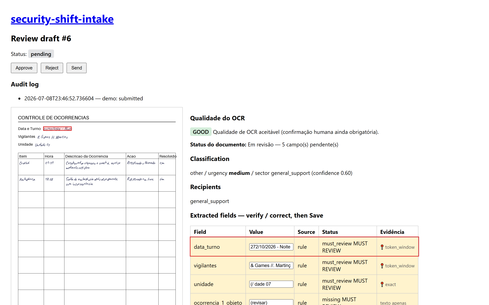

# Security Shift Intake — Local Document AI for Security Incident Logs

[](https://github.com/JoaoMiltzarek/security-shift-intake/actions/workflows/ci.yml)


Offline, privacy-first document-extraction pipeline for handwritten **security incident sheets**
("Controle de ocorrências"). It turns a scanned/photographed sheet into two useful outputs — a
**standardized spreadsheet** and a **copy-ready message** — with local OCR, mandatory human
review, audit trails, and safe automation gates.

> **OCR is best-effort. Human approval is mandatory. Unsafe automation is blocked.**

```
folha (PDF/foto) → OCR local → extração estruturada → revisão humana → planilha + mensagem
```

## The problem
Every shift, a guard fills a paper occurrence sheet by hand; someone retypes it into a
spreadsheet and a message. It's manual, repetitive, and error-prone. And it's hard to automate
honestly: the sheets are **handwritten** (free OCR fails on cursive), the data is **sensitive
PII** (must not go to an external API), and automation **must not invent** information.

## The solution
A staged, **config-driven** pipeline that runs **100% locally** (no paid API, no cloud):
local OCR → best-effort extraction → an **OCR quality gate** → auditable per-field results →
normalization → **human review** → blocked drafts when unsafe → an immutable audit trail.
It doesn't replace the human; it **reduces transcription load and surfaces uncertainty**.

### Two outputs
**Output 1 — standardized spreadsheet**

| DIA | UNIDADE | OBJETO | DESCRIÇÃO |
|---|---|---|---|
| 25/06/2026 | 1 | Alarme | HH:MM - Alarme disparou 4 vezes |
| 25/06/2026 | 2 | Sem alteração | |

**Output 2 — copy-ready message** (paste into WhatsApp/e-mail; never auto-sent):

```
Bom dia,

DIA | UNIDADE | OBJETO | DESCRIÇÃO
25/06/2026 | 1 | Alarme | HH:MM - Alarme disparou 4 vezes
25/06/2026 | 2 | Sem alteração |

Vigilantes: ...
```

If any required field is pending, the message is marked **`RASCUNHO INCOMPLETO`** and lists
exactly what to fix — it never goes out as a clean operational message.

## Evidence cockpit (auditable review)
The review screen is an **evidence cockpit**: the OCR page image sits beside the extracted
fields, and clicking a field highlights the **probable region** the value came from. Every
value answers *where it came from, with what confidence, by which method, and whether a human
reviewed it*:



- **`exact`** — the value matched a contiguous run of OCR words (box = union of those words).
- **`token_window`** — the value's tokens matched within one OCR line (partial score).
- **`none`** — no match; the field shows a textual fallback, never a blank or a wrong box.
- **`human_edit`** — a human edited the value, so the old OCR box is **discarded**.

The box is **probable evidence, not ground truth** — a hint that points the reviewer at the
most likely source region. Boxes are normalized (0..1) against the *same* downscaled image
Tesseract read, so the overlay lines up; the image is served **path-safe** from the gitignored
`private/` tree. When the reader emits no geometry (mock/VLM path), the cockpit degrades to the
plain review layout. Reviewed sheets export to **CSV** — but the button is **blocked while any
field is pending**, and the CSV always carries the post-review values, never the raw OCR.

## Quick demo
```bash
uv sync

# Public synthetic demo — no real file, no API, $0:
make demo-pipeline-mock        # creates review drafts; prints the URLs
INTAKE_CONFIG=configs/controle_ocorrencias.yaml uv run uvicorn src.api.app:app
#   open http://127.0.0.1:8000/

# Quality gate (598 tests, mocked, $0) and the privacy guardrail:
make check
make privacy-check
```
Process a **real** sheet locally (needs Tesseract + the `por` language data; the file stays in
the gitignored `private/` folder, never committed):
```bash
# Defaults to the v1 occurrence-table config (configs/controle_ocorrencias.yaml);
# override with CONFIG=configs/htmicron_security.yaml for the legacy scalar form.
make demo-pipeline FILE=private/reais/example.pdf
make purge-demo-data           # wipe temporary demo artifacts when done
```

### See the evidence cockpit
The clickable overlay needs real OCR geometry, so run the **Tesseract** path on the committed
synthetic sheet, then open the printed review URL (image left, fields right, click to highlight):
```bash
make demo-pipeline FILE=samples/sample_doc-00000.png CONFIG=configs/controle_ocorrencias.yaml
INTAKE_CONFIG=configs/controle_ocorrencias.yaml uv run uvicorn src.api.app:app
```
> The mock demo (`make demo-pipeline-mock`) has no OCR geometry, so it shows the cockpit's
> textual-fallback layout, not the clickable overlay.

### Demo de 3 minutos (dois leitores, honesta sobre o que cada um mostra)
```bash
# (a) Sem setup extra — Tesseract: bbox REAL no cockpit + gate humano + saída bloqueada
#     enquanto houver pendência:
make demo-pipeline FILE=samples/sample_doc-00000.png

# (b) Com Ollama — o VLM local lê o manuscrito que o Tesseract não lê:
ollama serve   # noutro terminal: ollama pull qwen2.5vl:3b (~3 GB, uma vez)
INTAKE_VISION=local_vlm make demo-pipeline FILE=samples/sample_doc-00000.png
```
Compare a transcrição/extração lado a lado. **Honestidade:** o caminho VLM (como o mock)
**não emite geometria** — o cockpit mostra o fallback textual, sem overlay clicável
(a UI tolera `bbox=None`); o bbox clicável é exclusivo do caminho Tesseract.

### Medir o leitor (a régua que decide — docs/DATASET_CONTRACT.md)
A decisão de adoção de leitor vem do **dataset sintético `tier_c`** (gates G-S0…G-S3 +
G1-S) + BRESSAY — nunca de folha real. Fábrica completa (PRs D0–D6 do contrato);
progresso e primeiras medições reais (G-S2) em `docs/STATUS_TIER_C.md`. O eval em folha real abaixo segue funcionando como
**avaliação local opcional** (folhas 100% autorizadas, locais, nunca versionadas):

```bash
# opcional/legado — pré-requisito humano: curadorias verified_by_user (docs/CURADORIA_FORMATO.md)
make eval-real VISION=local_ocr DPI=150      # baseline instrumentado
make eval-real VISION=local_vlm DPI=150      # a medição que decide (precisa de Ollama)
make eval-real VISION=local_vlm DPI=250      # sensibilidade a DPI (OOM de VRAM? reduza p/ 100)
PYTHONPATH=. uv run python -m evals.eval_extraction_real --compare \
  private/audit/eval_real_detailed_local_ocr_dpi150.json \
  private/audit/eval_real_detailed_local_vlm_dpi150.json   # pareado por campo (gate G1)
```
Saídas: detalhado (PII) em `private/audit/` (gitignored); resumo público **por whitelist**
em `docs/eval_real_summary.json`. Sanity check secundário do leitor:
`python scripts/build_bressay_manifest.py --bressay-dir data/bressay --n 20 && make eval-bressay N=20`.

## Setup & troubleshooting
The supported platform is **Linux / WSL / CI (Ubuntu)**. Windows native works as a
**documented fallback** — the tests and demo run, but the live browser-smoke gate runs in CI,
not locally. Probe your environment before running:
```bash
python3 scripts/preflight.py --json   # stdlib only; needs no uv/venv
```
It reports uv/make/tesseract/chromium, symlink support, stray SQLite DBs, and the pre-commit
hook, with a severity (0 clean / 1 warn / 2 blocker) — it only detects, never mutates.

- **No `make`?** Run the underlying commands: `uv run pytest`, `uv run ruff check .`,
  `uv run mypy src data scripts`.
- **No Tesseract?** The OCR path can't read handwriting, so fields route to human review and the
  cockpit shows its textual-fallback layout — the mock demo still runs end to end.

## Architecture (in 10 seconds)
```
ingest → transcribe → extract → normalize → validate → OCR quality gate → classify/route → outputs → human gate
```
Two decoupled models keep the domain stable as the sheet layout changes:
- **`RawDocumentExtraction`** — what was read (header + table cells), each an **`AuditedField`**
  (value + confidence + source `ocr|rule|human` + status + evidence).
- **`NormalizedIncidentModel`** — what the domain understands (shift + occurrences, or `S/A`).

Full details: [docs/ARCHITECTURE.md](docs/ARCHITECTURE.md). Why this schema:
[docs/ADR_controle_ocorrencias_schema.md](docs/ADR_controle_ocorrencias_schema.md).

## Privacy & security
Real sheets are PII and stay **only in `private/`** (gitignored). No external API is used in
the default flow. Public artifacts carry **aggregate metrics + synthetic examples only**.
`make privacy-check` fails on any tracked real data or PII in public files; scoped
`purge-*` targets clean up without destroying validated curadoria. See
[docs/PRIVACY.md](docs/PRIVACY.md).

> **Run it on localhost only.** The review API/UI has **no authentication** and its endpoints
> return the full document state (including the transcription). It is a single-operator local
> tool — do **not** expose it to a network or deploy it publicly without adding auth first.

## Results & honest limitations
- **The pipeline is correct and safe** (real sheets, human-verified ground truth —
  4/4 curated sheets verified, the 2 with archived sources ran):
  reshaping to the occurrence-table model + the OCR gate took **blocking errors from 2 → 0**
  (no false incident on an `S/A` sheet; a real occurrence is now represented, not dropped).
  Numbers and methodology: [docs/AUDITORIA_FOLHAS_REAIS.md](docs/AUDITORIA_FOLHAS_REAIS.md).
- **OCR fidelity is the honest ceiling.** Tesseract reads printed labels well but **cannot read
  cursive handwriting** — measured across DPIs and preprocessing variants, no meaningful gain.
  So real handwritten values come back low-confidence and are routed to **human review**; the
  system never presents OCR noise as trustworthy data, and never auto-classifies a document it
  couldn't read. Raising fidelity needs a better reader — see Roadmap.
- **Synthetic evals** (classification/routing) are reproducible via `make eval`
  ([EVAL_REPORT.md](EVAL_REPORT.md)); their caveats (templated labels are partly circular) are
  stated there. No number in this repo is hand-typed.

## What was tested
598 tests (ruff + mypy strict + pytest), all mocked and offline at $0, green in CI. Coverage
includes: OCR quality gate, the two-model schema, normalization, the table extractor, the
critic, the human-approval gate (an unapproved/pending draft **cannot** be approved or sent),
the outputs, the review UI, and the evidence cockpit — the 3-level locator (`exact` /
`token_window` / `none`), `human_edit` dropping the OCR box, path-traversal-safe page-image
serving, XSS-safe overlay rendering, and CSV export blocked until review is complete. The
stdlib preflight probe (DB/severity contract) and the evidence collector are unit-tested; the
live cockpit is proven by a **blocking browser-smoke gate** in CI (real Chromium under CSP).

## Evaluation results (synthetic benchmark + real-handwriting check)

Every number below is produced by committed code and read from a committed JSON — never
hand-typed: [eval_g1s_calibration.json](docs/eval_g1s_calibration.json),
[eval_synthetic_summary.json](docs/eval_synthetic_summary.json),
[eval_bressay_baseline.json](docs/eval_bressay_baseline.json). Protocol
([DATASET_CONTRACT.md](docs/DATASET_CONTRACT.md) §10): calibrate on `val`, freeze thresholds
in a commit, then run `test` exactly **once** — no target moves after seeing the test.

**Reader ruler — `bench-balanced` val (45 synthetic sheets):**

| Metric (val) | Tesseract 5 (DPI 150) | qwen2.5vl:3b (DPI 100) |
|---|---|---|
| parse_table_success_rate | 0.40 | 0.5556 |
| estimated_chars_to_type | 3264 | 4902 |
| false_incident_count | **4** | 9 |
| hora_acc | 0.0714 | 0.3929 |
| correct_refusal_rate (S/A) | 1.0 | 1.0 |

Chosen reader: **Tesseract (local_ocr)** — fewer hallucinated incidents and fewer characters
left for a human to type. The local VLM was rejected: it invents occurrences on degraded
sheets, the one error a triage tool must never make.

**G1-S gate — `bench-balanced` test (45 sheets, run once, Tesseract):**

| Criterion (frozen before the test) | Threshold | Test | Pass |
|---|---|---|---|
| parse_table_success_rate | ≥ 0.30 | 0.1111 | ❌ |
| false_incident_count | ≤ 6 | 1 | ✅ |
| estimated_chars_to_type | ≤ 4000 | 2827 | ✅ |
| hora_acc | ≥ 0.0 | 0.0 | ✅ |

**Verdict: G1-S FAILED — published as-is.** The test split holds out an unseen layout
variant and unseen degradation bands (anti-memorisation, contract §5); table parsing
collapsed from 0.40 (val) to 0.11 (test) and 22 incidents were missed (val: 0). The safety
invariants held: no `S/A` sheet ever became an incident (correct_refusal_rate = 1.0, one
false incident in 45 sheets), and every unparsed sheet routes to human review — the pipeline
degrades to "a human transcribes", never to silently wrong data. Verdict block written by
[scripts/g1s_verdict.py](scripts/g1s_verdict.py), which refuses a second test run.

**BRESSAY (real Brazilian-Portuguese handwriting, 20 word crops, frozen manifest):**

| Reader | mean CER |
|---|---|
| Tesseract 5 | 1.0 (reads none of it) |
| qwen2.5vl:3b | 4.30 (hallucinates long insertions — worse than typing nothing) |

**What these numbers mean (honest limitations):** Tesseract cannot read cursive handwriting;
the local VLM fabricates content (CER > 1 on real handwriting, phantom incidents on synthetic
sheets). No zero-cost reader is adopted as an automatic transcriber. This system is a
**triage assistant with a mandatory human-approval gate** — it standardises output, surfaces
evidence, and blocks anything unreviewed — not an autonomous decision-maker. Adopting a
better reader (Roadmap) requires beating this same frozen gate in a new val → freeze → test
cycle.

## Roadmap
A better reader (local VLM / PaddleOCR / table models), multi-sheet aggregation, `.xlsx` export,
and richer occurrence-table editing — all deferred to keep v1.0 clean.
See [docs/ROADMAP.md](docs/ROADMAP.md).

## License

This project is source-available under the [PolyForm Noncommercial License 1.0.0](./LICENSE).

Noncommercial use is allowed. Commercial use requires a separate written commercial license from the project owner.

Commercial use includes internal company use, client projects, consulting, SaaS, paid products, automation pipelines, operational deployment, or processing real operational documents for commercial or organizational benefit.

See [COMMERCIAL-LICENSE.md](./COMMERCIAL-LICENSE.md) for commercial licensing terms.

Synthetic data only; no real personal or organizational data is included.