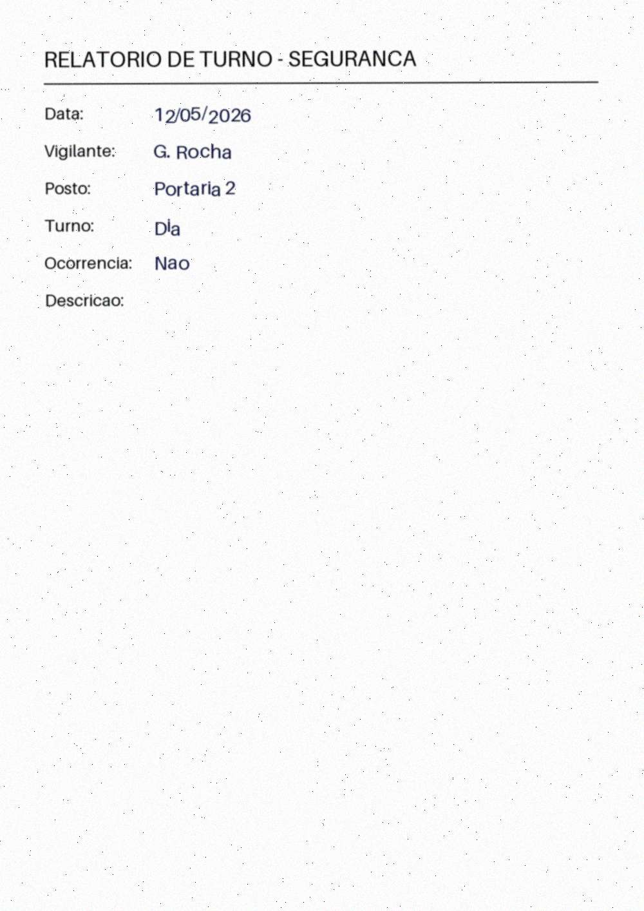

# security-shift-intake

[](https://github.com/JoaoMiltzarek/security-shift-intake/actions/workflows/ci.yml)


A **configurable, staged document-intake pipeline** that turns a scanned, handwritten
security shift-report PDF into a faithful transcription, structured fields, a
classification (type / urgency / responsible sector), and a **routed, pre-filled email
draft** — held behind a **human-approval gate** so nothing is ever sent automatically.

It is an internal triage tool whose job is to **reduce transcription load and surface
uncertainty**, not to achieve autonomy. Built as a portfolio-grade artifact: typed API,
mockable model layer, reproducible evals, CI, and synthetic-only data.

---

## What it is — and what it is not

**Is:** a linear pipeline of **deterministic stages**, each using the simplest tool that
works; a real state machine for approvals; an honest, baseline-anchored eval harness.

**Is NOT:**
-  an "autonomous multi-agent" system — it is a staged pipeline (no agent loops/planners).
-  an auto-sender — **email is never sent without explicit human approval.**
- a multi-tenant SaaS — one report type, one org config (the abstraction lives in the *structure*).
- trained on or storing **any real data** — **synthetic only**, enforced by a pre-commit guard.

### Non-negotiable invariants
1. **Human approval gate** before any irreversible action (sending email).
2. **Synthetic data only** in the repo — no real reports, names, or photos.
3. **No fabricated metrics** — every number comes from code that ran (`make eval`).
4. **Config-driven, not hardcoded** — fields, taxonomy, routing, and templates live in YAML.

---

## Architecture

```
 PDF (scanned, handwritten)
        │
   [0] Ingest ──────────► rasterize PDF → image(s) @ ~250 DPI          (PyMuPDF)
        │
   [1] Transcribe ──────► VLM reads image → verbatim text + confidence (VisionClient)
        │
   [2] Extract ─────────► text → structured fields + per-field conf.    (LLMClient, Pydantic)
        │
   [3] Validate (critic)► types / required / allowed values + threshold → MUST_REVIEW
        │
   [4] Classify ────────► incident type / urgency / sector             (LLM structured output)
        │
   [5] Route + Draft ───► deterministic recipients from YAML rules → Jinja email draft
        │
   [6] Human Gate ──────► reviewer sees transcription | fields | classification | draft
                          → approve / reject → only then (mock) send + audit
```

Every model call goes through a single `VisionClient` / `LLMClient` interface, so the
provider is swappable and **mockable in tests** — the whole suite runs offline at **$0**.

A rendered Tier B sample (synthetic, scan-degraded):



---

## Tech stack

| Tool | Role |
|---|---|
| **Python 3.11**, **uv** | language + reproducible, pinned dependency management |
| **Pydantic v2** | typed contracts between stages, config, structured output |
| **PyMuPDF** | PDF → image rasterization |
| **Pillow + NumPy** | synthetic handwriting render + scan degradation |
| **Anthropic (Claude vision)** | transcription + extraction + classification (behind `VisionClient`/`LLMClient`) |
| **scikit-learn** | trained classifier (documented evolution path) + classification metrics |
| **Tesseract** (`pytesseract`) | OCR **baseline only** (to prove the VLM earns its cost) |
| **FastAPI + HTMX + Jinja2** | approval API + thin server-rendered review UI |
| **SQLModel + SQLite** | persisted drafts, statuses, audit log |
| **pytest**, **ruff**, **mypy (strict)**, **GitHub Actions** | tests, lint, types, CI |

---

## Quickstart

```bash
# Prerequisites: Python 3.11+, uv (https://docs.astral.sh/uv/), GNU make
uv sync                       # install deps from the lockfile

make lint typecheck test      # quality gate (200+ tests, all mocked, $0)
make validate-config          # validate configs/htmicron_security.yaml
make gen-data                 # Tier A: structured synthetic records → data/synthetic/
make gen-pdfs                 # Tier B: handwritten-form PDFs → data/synthetic/tier_b/ + samples/
make eval                     # metrics.json + EVAL_REPORT.md (real numbers, baselines)
```

Run the API + review UI locally:

```bash
uv run uvicorn src.api.app:app --reload
# open http://127.0.0.1:8000/        → list of drafts
# open http://127.0.0.1:8000/docs    → OpenAPI
```

### Make targets

| Target | What it does |
|---|---|
| `make lint` / `format` / `typecheck` / `test` | ruff, ruff format, mypy (strict), pytest |
| `make check` | lint + typecheck + test (the CI quality gate) |
| `make validate-config` | validate a report-type YAML against the schema-for-the-schema |
| `make gen-data` | generate Tier A records (seeded, train/val/test split) |
| `make gen-pdfs` | render + scan-degrade Tier B PDFs + committable samples |
| `make demo-transcribe FILE=...` | run the **real** VLM on one PDF (needs an API key) |
| `make eval` | run the eval harness → `metrics.json` + `EVAL_REPORT.md` |

---

## Repository layout

```
configs/        report-type YAML (fields, taxonomy, routing, template)
src/
  schema/       Pydantic models: config, report schema, pipeline state
  clients/      VisionClient / LLMClient (+ mock and Anthropic implementations)
  pipeline/     ingest, transcribe, extract, validate, classify, route, draft
  classifier/   sklearn evolution-path model + baselines
  api/          FastAPI app, persistence, repository, approval gate, audit
ui/templates/   HTMX + Jinja review screen
data/generators/ Tier A (records, messiness) + Tier B (render, degrade)
evals/          metric primitives + per-component evals + report generator
skills/         encoded project rules (see below)
tests/          unit (mocked), integration, distribution tests
```

---

## Data strategy (synthetic, statistically honest)

Generated in two tiers (see `data/generators/` and the
`synthetic-data-generation` skill):

- **Tier A — structured ground truth.** Records sampled from **documented, non-uniform
  priors** that preserve joint distributions (`urgency|type`, `sector|type`, day/night
  effects), with realistic messiness (abbreviations, misspellings, blank optional fields,
  ambiguous characters) injected at documented rates. A distribution test proves the data
  is **not** uniform.
- **Tier B — rendered handwritten PDFs.** Tier A records laid out on a form with
  handwriting-style rendering, then scan-degraded (skew, blur, Gaussian/salt-pepper noise,
  JPEG) to mimic a printer-scan → PDF, then rasterized back — round-tripping the real path.

### Honesty caveats (read before trusting any number)
- **Font-handwriting is easier than real handwriting** → Tier B transcription/extraction
  scores are an **optimistic upper bound**. (No fonts are bundled; without TTFs in
  `assets/fonts/`, rendering falls back to a typed font — further still from real handwriting.)
- **Synthetic labels make the classification eval partly circular** — it measures recovering
  the generator's rules, not real-world generalization. Transcription/extraction are the
  meaningful evals; classification numbers are directional.
- **Reproducibility:** everything is seeded and versioned; train/val/test splits hold out
  disjoint records (no leakage).

---

## Evaluation

`make eval` computes every metric on a held-out set and writes
[`EVAL_REPORT.md`](EVAL_REPORT.md) from `metrics.json` — **no number is hand-typed**
(see the `eval-harness` skill).

- **Classification** — accuracy, macro-F1, per-class P/R, confusion matrix for the trained
  sklearn model vs **majority** and **keyword** baselines.
- **Routing** — recipient-selection accuracy vs the documented YAML rules (regression guard).
- **Transcription** — **Tesseract OCR baseline** (CER/WER); skipped gracefully if the binary
  is absent locally, run for real in CI.
- **Pending (mock-first):** VLM transcription/extraction, end-to-end accuracy, and the
  critic's error-flag recall are computed once an API key is available — they are recorded
  as *pending*, **never fabricated**.

The CI `smoke-eval` job installs Tesseract, runs the harness on a tiny fixture, and uploads
the artifacts.

---

## The human-approval gate (the core safety property)

Drafts are persisted with a real state machine:

```
pending ──approve──▶ approved ──send──▶ (sent)
   └─────reject────▶ rejected
```

- The send step **asserts `status == approved`** and is otherwise a hard block — the email
  sender is **never** called, and the blocked attempt is audited.
- Every transition (submitted / approved / rejected / sent / send_blocked) writes an
  immutable audit row (who / what / when).
- This is enforced and tested at three layers — the gate, the API (`409`), and the UI — with
  a test proving an unapproved draft **cannot** be sent. See the `human-approval-gate` skill.

---

## Running the real model (mock-first)

Tests and CI use a **mock** model layer (deterministic, $0) — no API key needed. To exercise
the real Claude vision path:

```bash
cp .env.example .env          # then set ANTHROPIC_API_KEY
make gen-pdfs                 # produce a sample PDF
make demo-transcribe FILE=data/synthetic/tier_b/pdfs/doc-00000.pdf
```

The model ID lives in config (`src/clients/settings.py`, default `claude-opus-4-8`,
overridable via `VISION_MODEL`). Mock vs. real behaviour is labelled everywhere it appears.

---

## Skills

Project rules are encoded as reusable skills under `skills/` so they are applied
consistently: `synthetic-data-generation`, `vlm-document-extraction`,
`human-approval-gate`, `eval-harness`, `config-schema-authoring`.

## Development

- **Quality gate:** `make check` (ruff + strict mypy + pytest). CI runs it on every push/PR.
- **Discipline:** small tested micro-steps — one isolated change → a covering test → run the
  real command → only then advance. The model layer is always mocked in tests.

## License

[MIT](LICENSE) © João Miltzarek. Synthetic data only; no real personal or organizational
data is included.
