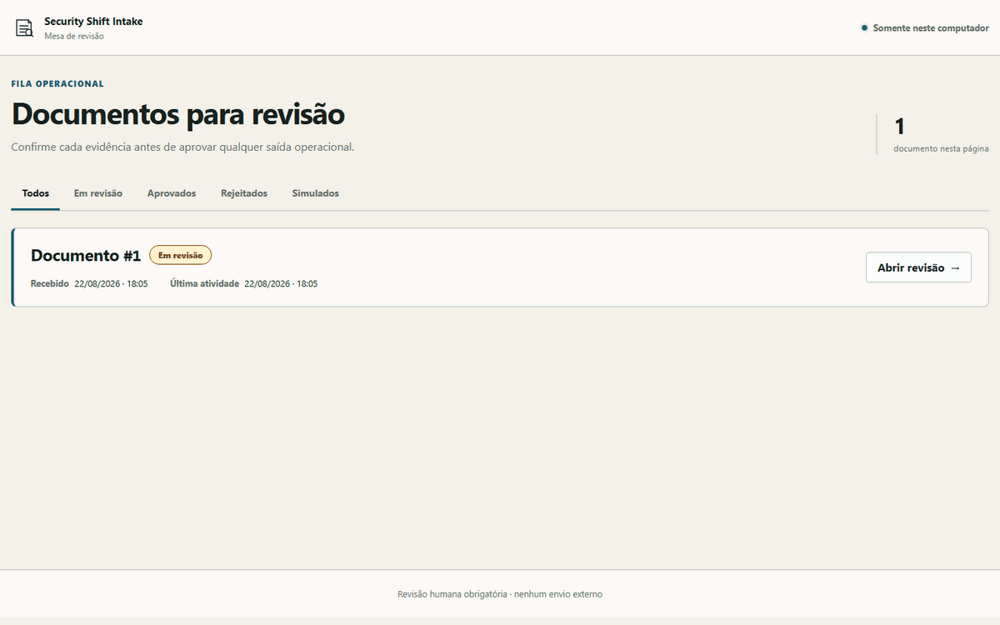
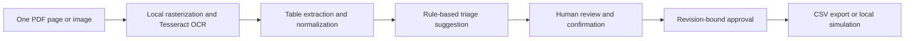

# Security Shift Intake

[](https://github.com/JoaoMiltzarek/security-shift-intake/actions/workflows/ci.yml)


Security Shift Intake turns one photographed or scanned **Controle de Ocorrências** sheet into
an evidence-backed review draft. It runs locally, uses Tesseract as a baseline reader, asks a
person to confirm the operational decisions, and unlocks CSV only for the approved revision.

The project addresses a practical gap between paper logs and downstream records without
pretending that free OCR can read cursive handwriting reliably. OCR is evidence, not authority:
uncertain content remains blocked until a reviewer supplies or confirms it.



This current v1.1 capture comes from the real Chromium smoke flow with deterministic synthetic
input. It shows the queue, evidence overlay, human-confirmed triage, revision-bound approval,
and CSV readiness. See the [approved static frame](samples/review_approved.png) and
[capture provenance](samples/README.md).

## What the v1.1 workflow does


```mermaid
flowchart LR
    A["One PDF page or image"] --> B["Local rasterization and Tesseract OCR"]
    B --> C["Table extraction and normalization"]
    C --> D["Rule-based triage suggestion"]
    D --> E["Human review and confirmation"]
    E --> F["Revision-bound approval"]
    F --> G["CSV export or local simulation"]
```

- Accepts exactly one page or image frame in PDF, PNG, JPEG, TIFF, BMP, or WebP format.
- Supports one report surface: the occurrence table defined in
  [`configs/controle_ocorrencias.yaml`](configs/controle_ocorrencias.yaml).
- Keeps the reader, page artifacts, SQLite state, review UI, and derived previews on the local
  machine.
- Separates the layout-coupled `RawDocumentExtraction` from the stable
  `NormalizedIncidentModel` domain model.
- Uses deterministic rules to suggest type, urgency, and sector. A human confirms or overrides
  that suggestion; recipients are always derived by the server.
- Recalculates structured readiness blockers before approval, CSV export, and simulation.
- Binds approval to the current revision, state hash, configuration, and evidence bytes. Any
  edit invalidates the previous approval.
- Provides a local simulation only. It does not send messages, email, or files.

Legacy stored states remain viewable but cannot be approved or exported. Re-ingest the source
document to create evidence under the current state contract.

## Quick demo

Requirements: Git, [uv](https://docs.astral.sh/uv/), Python 3.11.15, Tesseract, and its
Portuguese language pack. The committed lockfile defines the Python environment.

```console
uv python install 3.11.15
uv sync --locked --python 3.11.15
make demo
```

The demo processes a committed synthetic sheet through local Tesseract, starts the review UI at
`http://127.0.0.1:8000`, and opens its draft. It does not transmit or deliver anything. Stop it
with `Ctrl+C`, then remove the generated demo state:

```console
make purge-demo-data
```

Without GNU Make, use the equivalent entrypoints:

```console
uv run --locked python -m scripts.showcase_demo
uv run --locked python -m scripts.purge_demo_data demo
```

## Windows setup

Run these commands in PowerShell from a trusted local checkout:

```powershell
winget install --exact --id astral-sh.uv
winget install --exact --id UB-Mannheim.TesseractOCR
uv python install 3.11.15
uv sync --locked --python 3.11.15
tesseract --list-langs
uv run --locked python scripts/preflight.py --json
uv run --locked python -m scripts.showcase_demo
```

The language list should contain `por`. Restart PowerShell after installing Tesseract if the
executable is not yet on `PATH`.

## Ubuntu setup

The reference Linux environment is Ubuntu 24.04:

```bash
sudo apt-get update
sudo apt-get install -y make tesseract-ocr tesseract-ocr-por
curl -LsSf https://astral.sh/uv/install.sh | sh
uv python install 3.11.15
uv sync --locked --python 3.11.15
tesseract --list-langs
make demo
```

Release evidence uses stricter package and runtime identities documented in
[`docs/EVAL_RELEASE.md`](docs/EVAL_RELEASE.md); a developer demo is not release evidence.

## Review and approval contract

The normalized disposition is `unknown`, `none`, or `present`. OCR and rules may suggest a
result, but a person must explicitly confirm the disposition. `none` cannot coexist with an
occurrence row, and `present` requires at least one valid row.

The reviewer can correct header fields and add, edit, or remove occurrence rows. Classification
controls accept only the active taxonomy. Routing, spreadsheet rows, and the message preview are
derived from the current state rather than stored as stale outputs.

Approval is unavailable when evidence changed, configuration differs, disposition or
classification is unconfirmed, fields remain pending, validation fails, or routing cannot be
resolved. CSV export and simulation additionally require an approval matching the current
revision and state SHA-256.

The JSON API exposes the same state through `GET /drafts/{id}`, including `approved_revision`,
`state_sha256`, `readiness`, and derived previews. Existing URLs, `src.api.asgi:app`, and
`create_app` remain the stable entrypoints.

## Use a private input

Keep real documents under the ignored `private/` tree:

```console
make demo-pipeline FILE="private/reais/your-sheet.pdf"
make serve PORT=8000
```

After the local session:

```console
make purge-demo-data
make purge-real-data CONFIRM=YES
make privacy-check
```

These purge commands remove named files but are not a secure erase. Backups, snapshots, exports,
and storage remnants need separate handling.

## Quality and evaluation

Run the locked local gates before committing:

```console
make check-test-env
make check
make validate-config
make privacy-check
make audit-deps
```

The v1.1 release-evidence path requires 45 synthetic validation inputs built by the pinned
Ubuntu workflow, committed as immutable inputs, and then consumed without regeneration by the
normal CI gate. This README does not claim a validated release result. Evidence is published
only after all blocking jobs validate the same commit and the write-once publisher accepts the
candidate. No historical or mock result substitutes for that record.

See [`docs/DATASET_CONTRACT.md`](docs/DATASET_CONTRACT.md) for the synthetic-data boundary and
[`docs/EVAL_RELEASE.md`](docs/EVAL_RELEASE.md) for evidence publication. Tesseract remains a
local baseline, not a claim of handwriting accuracy; the concise experiment conclusion is in
[`docs/READER_DECISION.md`](docs/READER_DECISION.md).

## Security and privacy boundary

This is an unauthenticated, single-operator application. Run one process on loopback only; do
not expose it to a LAN, reverse proxy, shared workstation, or the public internet. See
[`SECURITY.md`](SECURITY.md).

Public fixtures are synthetic. Real sheets, databases, page images, transcripts, and detailed
evaluation artifacts belong under `private/`. `make privacy-check` is a heuristic defense in
depth, not proof that arbitrary sensitive data is absent. See [`docs/PRIVACY.md`](docs/PRIVACY.md).

## Project documentation

- [`docs/ARCHITECTURE.md`](docs/ARCHITECTURE.md) — components, trust boundaries, and state flow
- [`docs/DATASET_CONTRACT.md`](docs/DATASET_CONTRACT.md) — synthetic corpus and reproducibility
- [`docs/EVAL_RELEASE.md`](docs/EVAL_RELEASE.md) — safety gates and evidence publication
- [`docs/ROADMAP.md`](docs/ROADMAP.md) — deliberate next steps beyond v1.1
- [`CONTRIBUTING.md`](CONTRIBUTING.md) — change and review rules

## License

Security Shift Intake is source-available under the
[PolyForm Noncommercial License 1.0.0](LICENSE). Commercial use requires a separate written
license for project-owned code; third-party components keep their own terms. See
[`COMMERCIAL-LICENSE.md`](COMMERCIAL-LICENSE.md) and
[`THIRD_PARTY_NOTICES.md`](THIRD_PARTY_NOTICES.md).

The repository contains synthetic examples only and no public corporate dataset.
